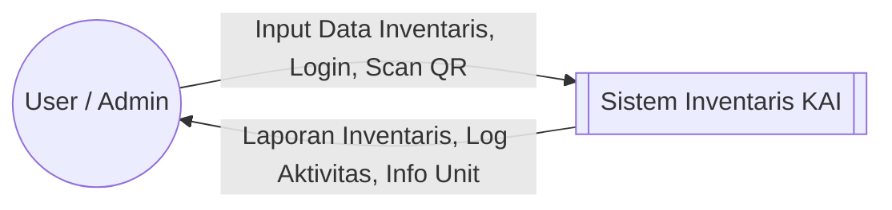
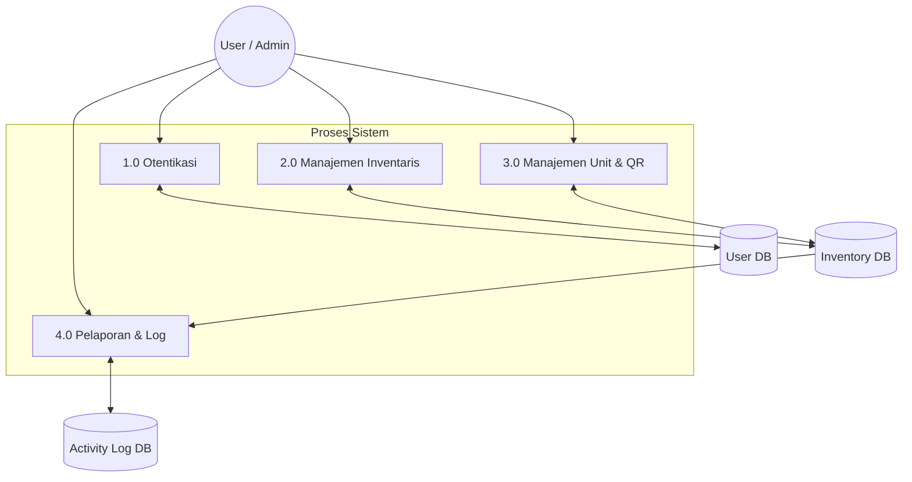
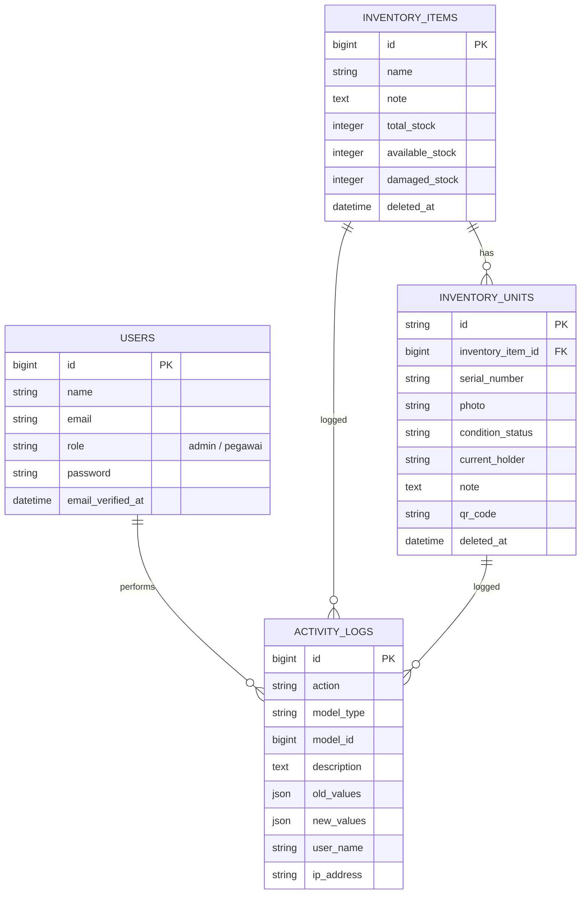

# Documentation System Inventaris KAI

Dokumen ini berisi diagram teknis untuk Sistem Manajemen Inventaris, termasuk Use Case Diagram, Data Flow Diagram (DFD), dan Entity Relationship Diagram (ERD).

---

## 1. Use Case Diagram
Use Case Diagram ini menggambarkan interaksi antara aktor (Admin & Pegawai) dengan fitur-fitur utama dalam sistem.

```mermaid
useCaseDiagram
    actor "Admin" as Admin
    actor "Pegawai" as Staff

    package "Sistem Inventaris" {
        usecase "Login & Kelola Profil" as UC1
        usecase "Monitoring Dashboard" as UC2
        usecase "Kelola Inventaris (Master Data)" as UC3
        usecase "Kelola Unit Inventaris (Serial Number)" as UC4
        usecase "Scan QR Code" as UC5
        usecase "Export Data (Excel/PDF)" as UC6
        usecase "Audit Trail (Activity Logs)" as UC7
    }

    Admin --> UC1
    Admin --> UC2
    Admin --> UC3
    Admin --> UC4
    Admin --> UC5
    Admin --> UC6
    Admin --> UC7

    Staff --> UC1
    Staff --> UC2
    Staff --> UC5
```

**Deskripsi Aktors:**
- **Admin**: Memiliki akses penuh ke seluruh fitur sistem, termasuk pengelolaan master data barang, unit, dan melihat log aktivitas seluruh pengguna.
- **Pegawai**: Memiliki akses terbatas, umumnya untuk melihat dashboard, mengelola profil sendiri, dan melakukan pemindaian (Scan) QR Code unit.

**Deskripsi:**
- **Admin/User**: Melakukan manajemen data barang, unit, dan melihat log aktivitas.
- **Scan QR Code**: Digunakan untuk identifikasi unit secara cepat di lapangan.
- **Activity Logs**: Mencatat setiap perubahan data untuk keperluan audit.

---

## 2. Data Flow Diagram (DFD) - Level 0
DFD Level 0 (Context Diagram) menunjukkan aliran data global antara entitas luar dan sistem.



### DFD Level 1
Menjelaskan proses internal sistem secara lebih rinci.



---

## 3. Entity Relationship Diagram (ERD)
ERD menggambarkan struktur database dan hubungan antar tabel.



---

## Cara Export ke PDF

Untuk mengubah dokumen ini menjadi PDF yang profesional, Anda dapat menggunakan salah satu cara berikut:

### Metode 1: Menggunakan VS Code (Direkomendasikan)
1. Pasang ekstensi **"Markdown PDF"** (oleh yyzhang).
2. Buka file `documentation.md`.
3. Tekan `Ctrl+Shift+P`, cari dan pilih **"Markdown PDF: Export (pdf)"**.

### Metode 2: Menggunakan Browser
1. Buka file `documentation.md` di browser (atau gunakan pratinjau Markdown).
2. Gunakan fitur **Print** (`Ctrl + P`).
3. Pilih **"Save as PDF"** sebagai tujuan printer.

### Metode 3: Menggunakan Obsidian atau Tool Markdown Lainnya
- Buka di aplikasi seperti Obsidian atau Typora, lalu pilih menu **Export to PDF**.
